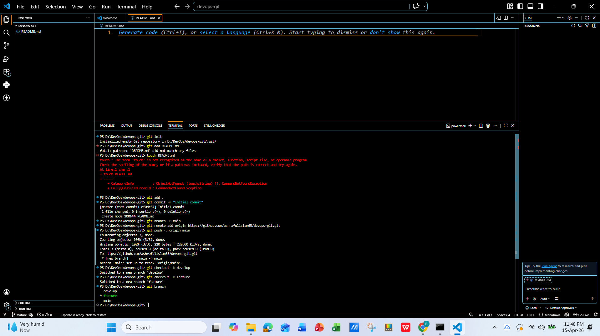
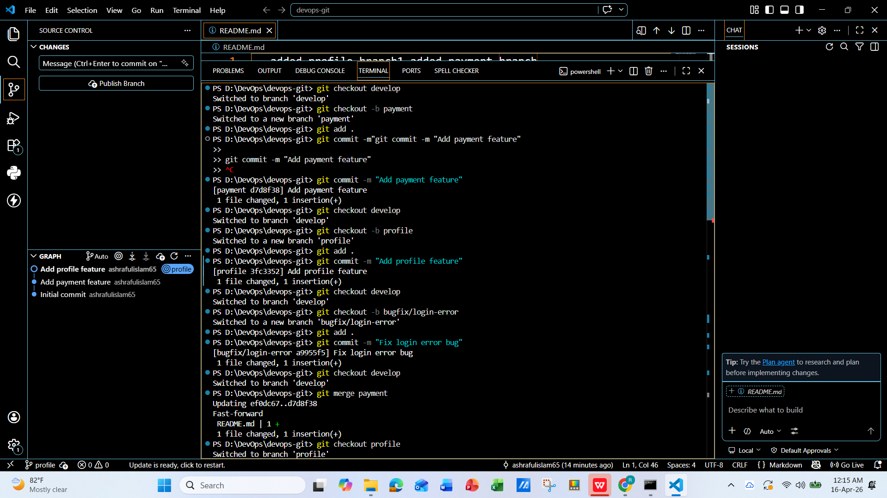
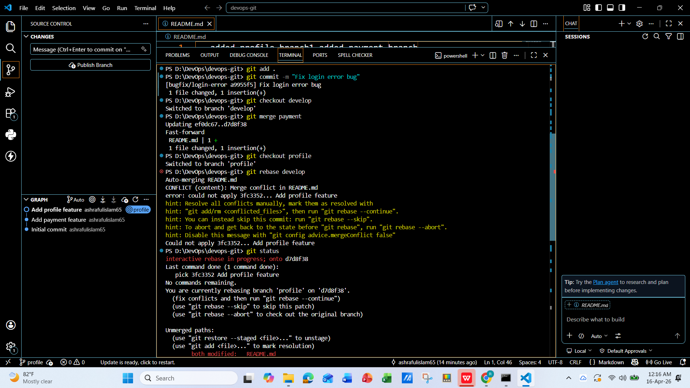
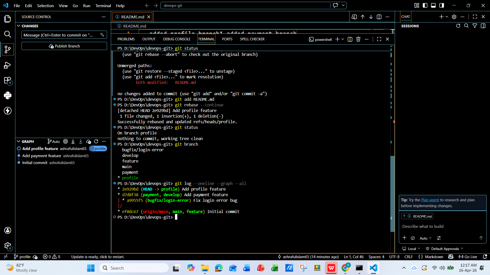
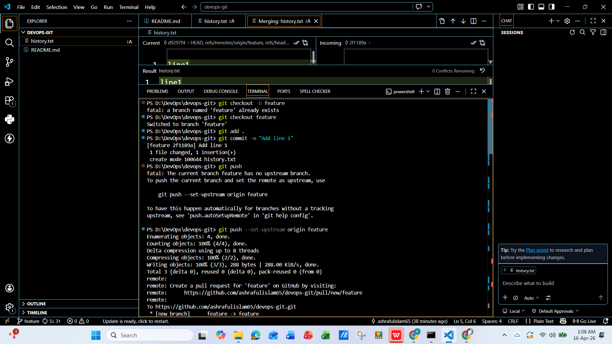
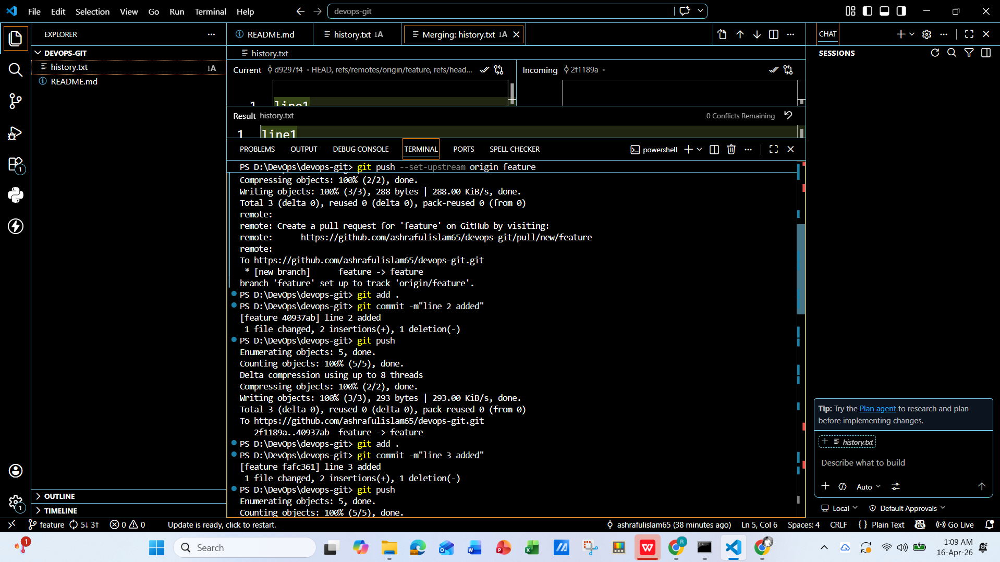
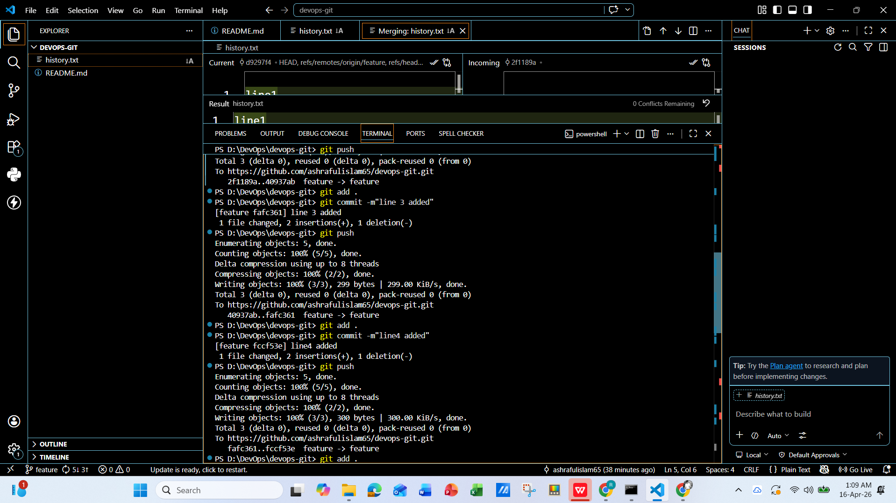
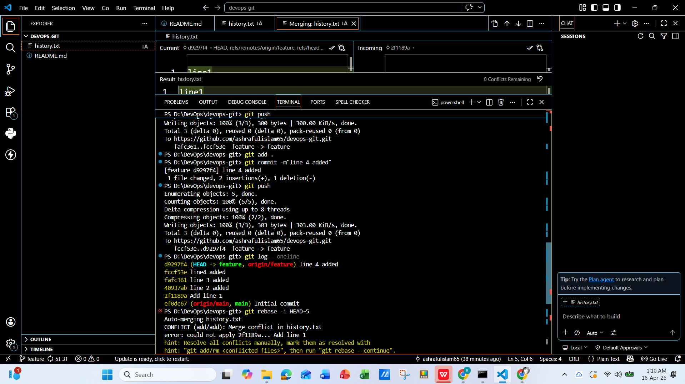
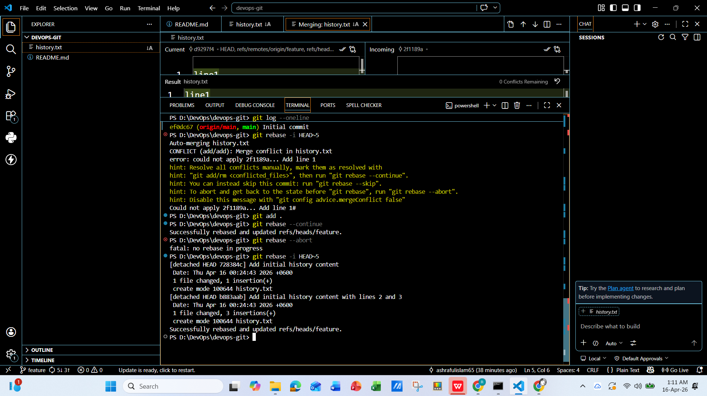

# 📦 Git Workflow Assignment

## 🔗 Repository Link

Add your GitHub repository link here:

```
https://github.com/ashrafulislam65/devops-git
```

---

# 🛠️ Task Description & Implementation

## 🔹 Task 1: Repository Initialization

### ✅ Commands Used

```bash
git init
git branch -M main
git checkout -b develop
git checkout -b feature/login
```

### ✅ Explanation

* Initialized a new Git repository
* Created three branches:

  * `main`
  * `develop`
  * `feature/login`

---

## 🔹 Task 2: Branching Workflow

### ✅ Commands Used

```bash
# Create feature branches
git checkout -b feature/payment
git checkout -b feature/profile

# Create bugfix branch
git checkout -b bugfix/login-error

# Merge strategy
git checkout develop
git merge feature/payment

# Rebase strategy
git checkout feature/profile
git rebase develop
```

### ✅ Explanation

* Created:

  * 2 feature branches (`feature/payment`, `feature/profile`)
  * 1 bugfix branch (`bugfix/login-error`)
* Used **merge** to combine `feature/payment` into `develop`
* Used **rebase** to update `feature/profile` with latest `develop`

---

## 🔹 Task 3: Commit History Management

### ✅ Commands Used

```bash
# Make multiple commits (example)
git commit -m "Add initial history content"
git commit -m "line 2 added"
git commit -m "line 3 added"
git commit -m "line 4 added"
git commit -m "line 5 added"

# Interactive rebase
git rebase -i HEAD~5
```

### ✅ Rebase Actions

```bash
pick commit1 Add initial history content
squash commit2 line 2 added
squash commit3 line 3 added
pick commit4 line 4 added
pick commit5 line 5 added
```

### ✅ Final Commit Message (after squash)

```
Add initial history content with lines 2 and 3
```

### ✅ Explanation

* Created 5 commits
* Used **interactive rebase**
* Combined commits using **squash**
* Modified commit message using **reword**

---

# 📚 Concept Explanation

## 🔹 Merge vs Rebase

### 🔸 Merge

* Combines branches with a **merge commit**
* Keeps full history
* Safe for shared branches

### 🔸 Rebase

* Moves commits on top of another branch
* Creates a **linear history**
* Cleaner but risky for shared branches

---

## 🔹 Squash & Reword

### 🔸 Squash

* Combines multiple commits into one
* Used to clean commit history

### 🔸 Reword

* Allows editing commit message
* Helps make messages clear and professional

---

# 🖼️ Screenshots Section

Add screenshots below:

## screenshots












---


---

✨ Assignment Completed Successfully
